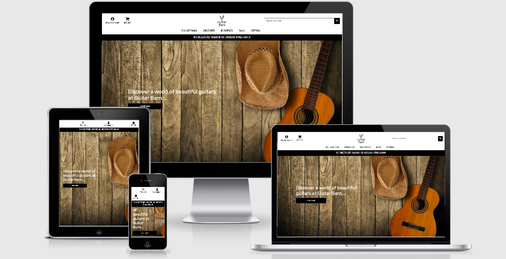

## Table of Contents

[User Experience](#user-experience)

- [User Goals](#user-goals)

- [User Stories](#user-stories)

- [Designer Strategy](#designer-strategy)

- [Design Elements](#design-elements)

- [Wireframes](#wireframes)

- [Features](#features)

    - [Features to be implemented in the future](#features-to-be-implemented-in-the-future)

- [Technologies used](#technologies-used)

    - [Other tools used to build the project](#other-tools-used-to-build-the-project)

- [Project database structure](#project-database-structure)

- [Project deployment](#project-deployment)

    - [Local deployment](#project-deployment)
    - [Heroku deployment](#heroku-deployment)

- [Testing](#testing) 

- [Credits](#credits)

    - [Contents](#contents)

    - [Media](#media)

    - [Inspiration and motivation](#inspiration-and-motivation)

    - [Acknowledgements](#acknowledgements)

- [Disclaimer](#disclaimer)

## User Experience

### User Goals

- I want a responsive website which works efficiently and effectively on a wide range of devices 
- I want a website which is both easy to navigate and user-friendly
- I want the website where I can use the proposed functionality with no obstacles

### User Stories 

- As a User, I want to view a specific category of products

- As a User, I want to search a product by name, price, rating or other category

- As a User, I want to easily see what I have searched for and to see number of results

- As a User, I want to add products I want to buy

- As a User, I want to be able to update the added products and be allowed to change the quantity
    or remove the products completely from the shopping cart

- As a User, I want to complete my purchase using a secure payment method

- As a User, I want to be able to get in touch with the website host

[Back to top](#table-of-contents)

### Designer Strategy

### Design Elements

[Back to top](#table-of-contents)

### Wireframes

The wireframes can be found [here]().

[Back to top](#table-of-contents)

### Features

Each page has the following items available:

- Links located in navbar (user account, search bar, shopping-cart, guitars available for sale)

    - Products 
        - available guitars for sale (user can access all guitars or
            check specific categories such as acoustic, electric and bass)
        
        - user can check the available products by sorting guitars using:
            - price
            - rating 
            - catgory

    - Cart 
        - if empty, user can click on Add Your Product button which redirects to Products page
        - shopping cart (user can add/remove the products)
        - user can go back to shopping if decides to add more items (Continue Shopping button)
        - redirect button to Secure Paymemt Checkout 
    
    - Checkout 
        - displays all purchased products (name, quantity, image, subtotal, delivery charge and final total amount)
        - allowing the user to complete th purchase using secure payment method, but only if the checkout form is
            completed
        - credit card payment stripe for making a payment (warning displays if invalid card is used)
    

- active Logo which redirects the user to homepage from other pages 

- guitar-related background image (home page only)

- banner with NO DELIVERY CHARGE ON ORDERS OVER #300

#### Features to be implemented in the future

- allowing the user to reset the password
- other paymemts methods 
- applying discounts 

[Back to top](#table-of-contents)

### Technologies used

#### Languages 

- HTML

- CSS

- JavaScript

- [Python](https://www.python.org/)

#### Main tools

- [GitHub]([GitHub](https://github.com/))

- [GitPod](https://www.gitpod.io/)

- [Heroku](https://www.heroku.com/)

- [Django-Allauth](https://django-allauth.readthedocs.io/en/latest/installation.html)

[Back to top](#table-of-contents)

#### Libraries and Frameworks

- [jQuery](https://jquery.com/)

- [Bootstrap](https://www.bootstrapcdn.com/)

- [Font Awesome](https://fontawesome.com/icons?d=gallery)

- [Google Fonts](https://fonts.google.com/)

- [Pillow](https://pillow.readthedocs.io/en/stable/)

- [Stripe](https://stripe.com/en-gb)

- [Gunicorn](https://pypi.org/project/gunicorn/)

#### Databases

- [PostGreSQL](https://www.postgresql.org/)

- [SQLite3](https://www.sqlite.org/index.html)

[Back to top](#table-of-contents)

#### Other tools used to build the project

- [Font Awesome](https://fontawesome.com/icons?d=gallery)

- [Google Fonts](https://fonts.google.com/)

- [Favicon](https://www.favicon-generator.org/)

- [Unicorn Revealer](https://chrome.google.com/webstore/detail/unicorn-revealer/lmlkphhdlngaicolpmaakfmhplagoaln?hl=en-GB)

- [Am I Responsive?](http://ami.responsivedesign.is/)

- [Find Unclosed Tags](https://www.aliciaramirez.com/closing-tags-checker/)

- [Autoprefixer CSS](https://autoprefixer.github.io/)

- [NekoCalc](https://nekocalc.com/)

- [JSON Formatter](https://jsonformatter.curiousconcept.com/#)

- [Free Logo Design](https://www.freelogodesign.org/)

- [PEP8](http://pep8online.com/)

- [JSHint](https://jshint.com/)

- [Markup Validation Service](https://validator.w3.org/)

- [CSS Validation Service](https://jigsaw.w3.org/css-validator/)

[Back to top](#table-of-contents)

### Project database structure

Used the following sources to build a database which would hold the product:

- **categories.json**
    - "pk":,
    - "model":
    - "fields":{
         "name":,
         "friendly_name:",}

- **products-json**
    - consists all details about the displayed products (product number,
        name, image, price, rating )

[Back to top](#table-of-contents)

### Project deployment

The project was built using [GitPod](https://www.gitpod.io/) and as a repository I used [GitHub](https://github.com/login).
The following tools need to be installed to make the deployment successful:

- **PIP**
- **Python3**
- **IDE** 
- ensure you have created free accounts with the following services: 
    - **Stripe**
    - **AWS**
    - **set up an S3 bucket - emailjs**

#### Local deployment

Follow the steps below to deploy the project locally:

1.  Follow the link to the [project-repository](https://github.com/KrisK1978/GuitarBarn).

2. Go to **Code** tab and use **Clone** to copy the URL `https://github.com/KrisK1978/GuitarBarn`
   from **Clone** with **HTTPs** for the repository.

3. Go to your local **IDE** and open a new command line - terminal.

4. Type in `git clone` in your terminal.

5. Install the required dependencies from **requirements.txt** file using the command below:
    - `pip3 -r requirements.txt`

6. Create environment variables within your IDE:

"HOSTNAME": "<enter hostname here>",
"SECRET_KEY": "<enter key here>",
"STRIPE_PUBLISHABLE": "<enter key here>",
"STRIPE_SECRET": "<enter key here>",
"AWS_ACCESS_KEY_ID": "<enter key here>",
"AWS_SECRET_ACCESS_KEY": "<enter key here>",
"AWS_STORAGE_BUCKET_NAME": "<enter bucket name here>"

7. Migrate the admin panel models to create your database template with the terminal command

**python3 manage.py migrate**.

8. Create a superuser to access the django admin panel and database using the following command:

- **python manage.py createsuperuser**

9. Add your admin username and password.

10. Run your project locally with the following command:

- **python3 manage.py runserver**

[Back to top](#table-of-contents)

#### Heroku deployment

Take the following steps to deploy the project the [GuitarBarn]() to **Heroku**:

 - Create a **requirements.txt** file using the command below:

    `pip3 freeze --local > requirements.txt`

 - Create a **Procfile** file using the following command:

    `echoweb: python app.py > Procfile`

    - *make sure it is a capital P and there is no file extension added*
    - *open a Procfile file and remove a blank line as if left it can cause problems with an app*

- Push new created files to **GitHub** repository.
- Go to [Heroku](https://id.heroku.com/login) and create a new app for this project using **Heroku Dashboard**.
- Remember to give your app a unique name and set up a region.
- In **Deployment** tab go to **Deployment Method** and click on **GitHub** icon to connect an app. Type in 
   *repository name* and hit *search*. Once repository is found click **Connect**.
- Go to **Settings** tab and open **Config Vars**. Add the following information:

[Back to top](#table-of-contents)

### Testing 

The project testing details can be found [here](https://github.com/KrisK1978/GuitarBarn/blob/master/TESTING.md).

[Back to top](#table-of-contents)

### Credits

[Back to top](#table-of-contents)

#### Contents
The contents of the website was written by me.

#### Media

 used the following media platforms to complete this project:

- [The North American Guitar](https://thenorthamericanguitar.com/)

- [Guitar Guitar](https://www.guitarguitar.co.uk/)

- [Andertons](https://www.andertons.co.uk/)

#### Inspiration and motivation
My main motovation to create this project was my admiration for this beautiful instrument which I find magical. I was aslo inspired by 
my friend who has been passionately explaining me the secrets of playing guitar.

[Back to top](#table-of-contents)

#### Acknowledgements

I would not be able to complete this project without a great support from my family and friend. I would like to personally 
thank you [Simen Daehlin](https://github.com/Eventyret) for mentoring me and providing with a constructive criticism.

I would like to thank my fellow [Code Institute](https://codeinstitute.net/) students and tutors for their advice and support.
I also want to to thank you the [Slack](https://slack.com/signin#/signin) community for helping me in resolving some coding issues. 

[Back to top](#table-of-contents)

### Disclaimer

Please note this web app was created for educational purposes only. 

[Back to top](#table-of-contents)